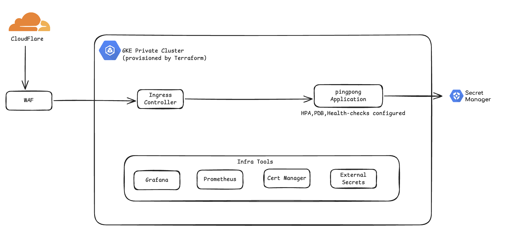
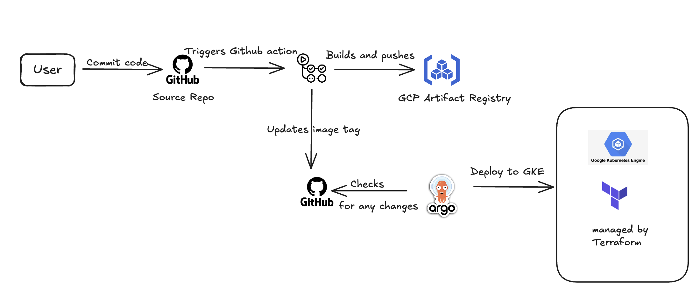

# Infra Deploy Demo

   ## Overview

   This project demonstrates a production-ready deployment pipeline for a containerized Node.js application on Google Cloud Platform (GCP), using modern DevOps practices:


   * **Docker** for containerizing the application.
   * **Terraform** for provisioning VPC, GKE cluster, Artifact Registry, and related resources.
   * **Helm** for packaging Kubernetes manifests as reusable charts.
   * **ArgoCD** for GitOps-style continuous deployment (automatically syncing chart changes).
   * **GitHub Actions** for CI: building images, pushing to Artifact Registry, and updating Helm values.
   * **OIDC (Workload Identity Federation)** to authenticate GitHub Actions to GCP without service account keys.

   ### Architecture Diagram

   

   ## Local Setup

   ### Option 01 - via Docker

   A [Dockerfile](./app/Dockerfile) is provided to build a **lean, secure, and performant container image** suitable for testing locally and for deploying to **GKE** (Google Kubernetes Engine) or any cloud provider.

   To build the image, run the following in the `/app` directory:

   ```bash
   $ docker build --platform=linux/arm64 -t ipapp:v1 .
   ```
   To test the image locally:

   ```bash
   $ docker run -d -p 8080:8080 ipapp:v1
   ```
   ### Option 02 - via docker-compose (suggested for development)

   To set up the development environment with hot reloading:

   ```bash
   $ cd ./app/
   $ docker compose up -d
   ```
   This builds and runs the Docker container, exposing port 3000 locally.

   ### Key Best Practices Followed:

   1. Node (Alpine) Base Image

      * Uses `node:22-alpine` to minimize the attack surface and image size.
   2. Non-root User

      * Adds a user and runs the app as that user.
      * Security best practice: avoid running apps as root inside containers.
   3. Clean EntryPoint

      * Uses `ENTRYPOINT` and `CMD` to run `npm start`, allowing overrides at runtime (used for running `npm run dev` for local testing).
   4. Hot Reloading

      * [docker-compose](./app/docker-compose.yaml) uses the same `Dockerfile` but with an overridden CMD (includes `nodemon` for auto-restart on code changes).
      * Keeps the production image lean while enabling auto-reload during development.
   5. Volume Mounting

      * Mounts the current project directory into the container:

        * `.:/app` keeps source code in sync.
        * `/app/node_modules` prevents host-container conflicts for `node_modules`.

   ## Infrastructure Setup

   ### Terraform (IaC)

   This project uses modular [Terraform](https://developer.hashicorp.com/terraform) to provision and manage infrastructure on [Google Cloud Platform (GCP)](https://cloud.google.com/). The setup is designed to be secure, production-ready, and follows best practices.

   #### Directory Structure

   ```
   .
   ├── backend.tf                                # Configures the Terraform backend (e.g.GCS for remote state)
   ├── main.tf                                   # Root module that wires together all submodules
   ├── modules
   │   ├── artifact_registry                     # Module to provision Google Artifact Registry
   │   │   ├── main.tf
   │   │   ├── outputs.tf
   │   │   └── variables.tf                      # Variables accepted by the module
   │   ├── gke                                   # Module to create GKE cluster and node pool
   │   │   ├── main.tf
   │   │   ├── outputs.tf
   │   │   └── variables.tf
   │   ├── oidc                                  # Module to configure Workload Identity Federation (GitHub OIDC)
   │   │   ├── main.tf
   │   │   ├── outputs.tf
   │   │   └── variables.tf
   │   └── vpc                                   # Module to create VPC, subnet, and secondary ranges
   │       ├── main.tf
   │       ├── outputs.tf
   │       └── variables.tf
   ├── outputs.tf
   ├── providers.tf                              # Provider configuration (e.g. Google)
   ├── terraform.tfvars                          # Variable values specific to this environment
   ├── variables.tf
   └── versions.tf
   ```
   #### Modules Overview:

   | Module                                                         | Purpose                                                                 |
   | -------------------------------------------------------------- | ----------------------------------------------------------------------- |
   | [vpc](./infra/terraform/modules/vpc/)                             | Creates a dedicated VPC and subnet with IP ranges for pods and services |
   | [artifact_registry](./infra/terraform/modules/artifact_registry/) | Creates a Google Artifact Registry for storing Docker images            |
   | [gke](./infra/terraform/modules/gke/)                             | Provisions a private GKE cluster and node pool                          |
   | [oidc](./infra/terraform/modules/oidc/)                           | Sets up Workload Identity Federation for GitHub Actions (OIDC)          |

   #### Prerequisites

   Executing this Terraform code expects:

   * A [GCP Project](https://cloud.google.com/)
   * A [Service Account](https://cloud.google.com/iam/docs/service-accounts-create) with permissions to create resources in the project
   * The [Keys](https://developers.google.com/workspace/guides/create-credentials) for the above Service Account
   * A [GCP Bucket](https://cloud.google.com/storage/docs/creating-buckets) to store the Terraform state file
   * Configure values in [terraform.tfvars](./infra/terraform/terraform.tfvars) file as per your requirements. Refer to [this document](./infra/terraform/README.md) to understand all supported variables

   #### Provisioning the Infra

   ```bash
   $ terraform init           # Initializes your backend
   $ terraform validate       # Validates the HCL config
   $ terraform plan -out=tfplan  # Plans the infrastructure
   $ terraform apply tfplan   # Applies the plan to create resources on the cloud
   ```
   **NOTE:**
   To destroy all resources provisioned by Terraform:

   ```bash
   $ terraform destroy
   ```
   ### Helm Chart

   This provides a boilerplate Helm chart that can be used to deploy most types of generic deployments.

   Directory structure:

   ```
   infra/helm-chart/
   ├── Chart.yaml                         # Contains information for the chart version; bumped when a new version of charts is released
   ├── templates
   │   ├── _helpers.tpl                   # Template helper functions
   │   ├── certificate.yaml               # Creates certificate using cert-manager CRDs
   |   ├── configmap.yaml                 # Creates configmap using provided details
   │   ├── deployment.yaml                # Creates deployment with configurable replicas 
   │   ├── dnsendpoint.yaml               # Istio dns-endpoint for exposing using gateway
   │   ├── gateway.yaml                   # Istio gateway which connects to Virtualservice
   │   ├── hpa.yaml                       # HorizontalPodAutoScaler based on threshold CPU and Memory Utilization
   │   ├── pdb.yaml                       # Specified PodDisruptionBudget for the above deployment
   │   ├── secret.yaml                    # Creates secret which is mounted in deployment
   │   ├── service.yaml                   # k8s service with configurable ports
   │   └── virtualservice.yaml            # Virtualservice template for istio with configurable routes
   └── values.yaml                        # Sample values file for any backend deployment
   ```
   All templates are conditional and configurable via `values.yaml`.

   #### Prerequisites

   Before deploying applications using Helm charts, make sure the following tools are installed in your Kubernetes cluster:

   - [Argo CD](https://argo-cd.readthedocs.io/en/stable/getting_started/) - GitOps continuous delivery tool for Kubernetes. It manages application deployments and keeps your cluster in sync with your Git repository.
   - [Istio](https://istio.io/latest/docs/setup/install/helm/) - enables service mesh features such as traffic routing, observability, and security. In this setup, it's used to expose application endpoints.
   - [Cert-Manager](https://cert-manager.io/docs/installation/helm/) - automates TLS certificate management, including Let's Encrypt and other issuers.
   - [External Secrets](https://external-secrets.io/latest/introduction/overview/) - syncs secrets from external providers (e.g., GCP Secret Manager) into Kubernetes as native secrets.

   ### CI/CD using GitHub Actions and ArgoCD

   This repository includes a [GitHub Actions](https://github.com/features/actions) workflow that automates the build and deployment of the application to GKE using ArgoCD and Helm.

   The [argocd](./infra/argocd/) directory contains the ArgoCD `Application` manifest to deploy the sample application using Helm.

   ### CI/CD Workflow

   The GitHub Actions pipeline performs the following steps:

   1. **Trigger**: Runs on push to the `release/production` branch.
   2. **Docker Build**: Builds the Docker image using the commit SHA as the tag.
   3. **Artifact Registry Push**: Pushes the image to Google Artifact Registry.
   4. **Update ArgoCD Values**: Modifies `values.yaml` in the `argocd/` directory to reference the new image tag.
   5. **Commit & Push**: Commits and pushes the updated `values.yaml` back to the same repository.
   6. **ArgoCD Sync**: ArgoCD detects the change and syncs the deployment automatically.

   

   ### Prerequisites

   * ArgoCD is installed and running in the `argocd` namespace
   * An ArgoCD project named `prod` has been created
   * Your Kubernetes cluster is accessible and configured for ArgoCD
   * The application source code is available at the specified GitHub repository and branch

   ### Directory Structure:

   ```
   ./infra/argocd/
   ├── application.yaml
   └── values.yaml
   ```
   ArgoCD watches the cluster (you can use the GKE cluster endpoint after creating infra using Terraform above) and the `values.yaml` for your application.

   [application.yaml](./infra/argocd/application.yaml) contains a `kind: Application` manifest file for the sample application. It specifies the cluster endpoint, source repo, target branch, and ArgoCD behavior configurations.

   ### Authentication via Workload Identity Federation

   This setup uses **OIDC-based authentication** to GCP using Workload Identity Federation for a secure and keyless CI/CD pipeline.

   * A Workload Identity Pool and Provider is configured in GCP
   * A service account `github-ci@<project-id>.iam.gserviceaccount.com` is bound with IAM roles
   * The GitHub Actions workflow uses `audience`, `provider`, and `service_account_email` to authenticate

   ### GitHub Secrets

   * `GCP_WIF_PROVIDER` – Workload Identity Provider full resource name
   * `GCP_SERVICE_ACCOUNT` – CI Service Account email
   * `GCP_PROJECT` – GCP Project ID
   * `GCP_ARTIFACT_REGISTRY_REGION` – Region of Artifact Registry (e.g., `europe-west2`)

   ## Monitoring (WIP)

   You can integrate **Prometheus**, **Grafana**, and **Loki** stack for full observability. Below are key metrics to monitor application health and performance:

   - **CPU & Memory Usage**Tracks resource utilization at the pod and node level. Helps in tuning HPA and identifying performance bottlenecks.
   - **Request Rate (req/sec)**Measures the number of incoming HTTP requests per second to the sample application, especially on the `/ip` endpoint.
   - **Request Latency**Captures the time taken to serve requests, broken down into percentiles (e.g., p50, p95, p99). Useful for tracking response time trends and detecting latency spikes.
   - **Pod Health & Availability**Monitors readiness and liveness probe results, number of restarts, and pod scheduling status.
   - **Error Rates**
     Tracks 4xx and 5xx HTTP status codes to help identify application or integration issues.

   ## Future Scope

   Below are planned improvements and additions to enhance automation, observability, and deployment strategies:

   1. **CI for Terraform**

      - `terraform-ci-plan`: triggered on PRs to `release/production`
        - Runs `terraform validate` and `terraform plan`
        - Posts the plan output as a PR comment
      - `terraform-ci-apply`: triggered on merge to `release/production`
        - Executes `terraform apply` to update infrastructure
   2. **Automated Prerequisite Deployment**

      - Add automation to deploy core tools like Argo CD, Istio, Cert-Manager, and External Secrets
      - Simplifies cluster bootstrapping and setup for new environments
   3. **Enhanced Rollout Strategies**

      - Add support for canary and blue-green deployments using `argo-rollouts`
      - Enable safer and more controlled progressive delivery
   4. **Ephemeral Environments**

      - Implement ephemeral (temporary) deployments for internal testing or preview environments
      - Useful for testing feature branches before merging
   5. **Deployment Notifications**

      - Add support for notifying teams (via Slack, email, etc.) when a deployment completes and is healthy
      - Helps improve visibility and response time
   6. **Integrated Observability Stack**

      - Use the Grafana + Prometheus + Loki stack to monitor application health, logs, and alerts
      - Some dashboards are already in place — refer to the screenshots below
   7. **CI for Helm Chart Versions**

      - Automate version bumps for `helm-chart/Chart.yaml` on merge
      - Include compatibility checks for consuming `values.yaml`
      - If compatible, auto-update `k8s/application.yaml` accordingly
